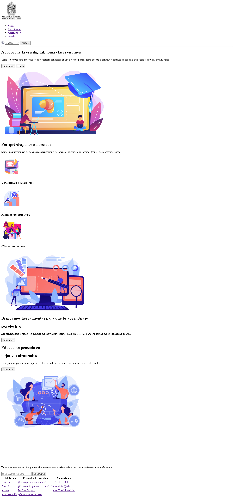
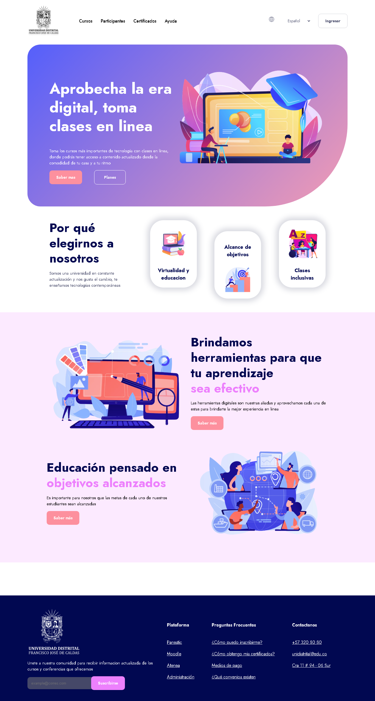
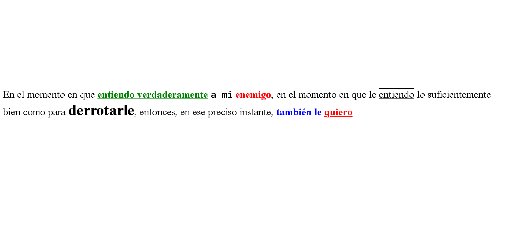
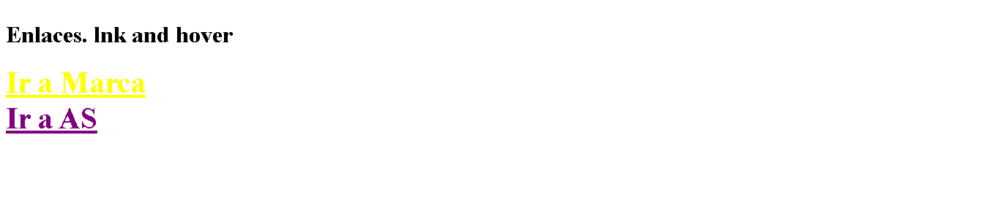
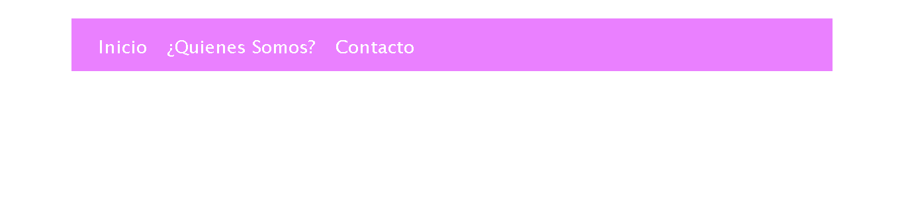
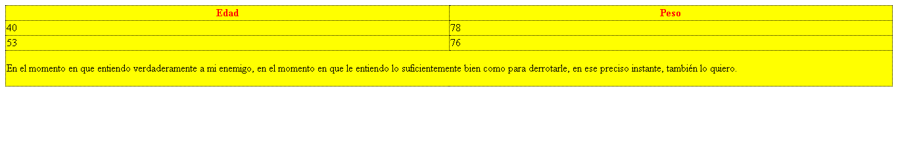

<h1>Taller 9 - Deiby Alejandro Suarez Ortiz</h1>

<h2>Información</h2>

Curso: Full Stack Basico - Grupo 1

Profesor: Cristian Felipe Patiño Cáceres

<h2>Link de la pagina Web</h2>

<a href="https://ryuck24.github.io/taller-9-full-stack/">

<h2>Punto 1: Link de Figma</h2>
<a href="https://www.figma.com/file/15iPZkBZYXqqDypuxw4Wtv/Deiby-Alejandro-Suarez-Ortiz?type=design&node-id=0%3A1&mode=design&t=G27YDdNqeMbrv8rk-1"><button>Figma</button></a>

<h2>Punto 2: Diseño en HTML</h2>
    

<h2>Punto 3: Diseño con CSS</h2>

<h2>Punto 4: Títulos</h2>

<h2>Punto 5: Párrafo</h2>

<h2>Punto 6: Links</h2>

<h2>Punto 7 y 8: Navegacion</h2>

<h2>Punto 9: Tabla</h2>

